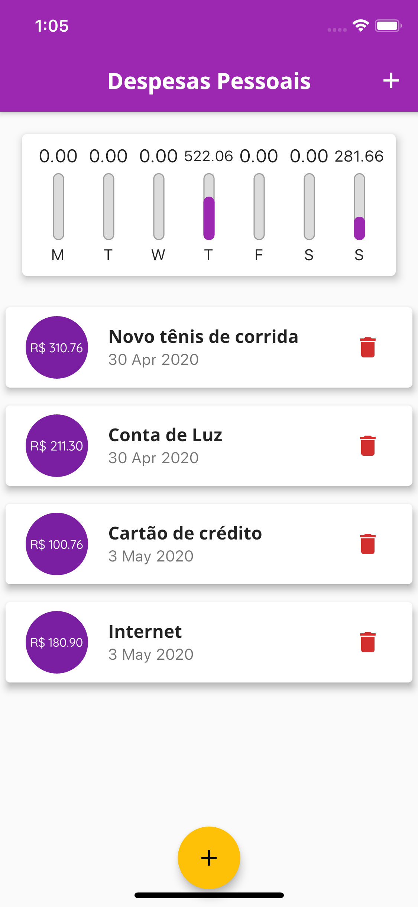

# Expenses

Esse um dos projetos propostos durante curso de flutter da [Cod3r](https://www.cod3r.com.br).

O app permite adicionar um despesa com data, remover despesa e também possui um gráfico apresentando o percentual de gastos nos últimos 7 dias.

## Prints

   
